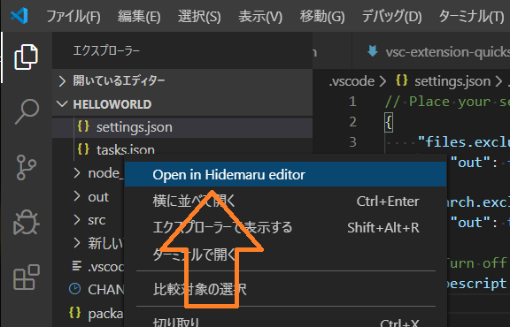
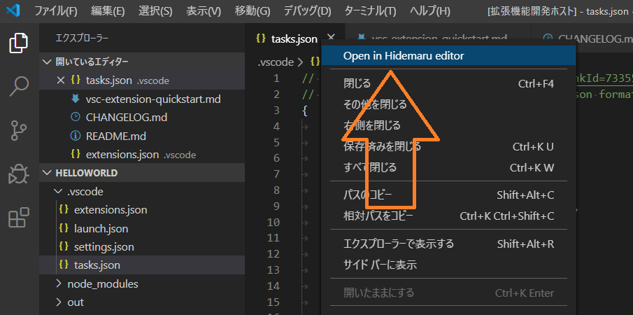
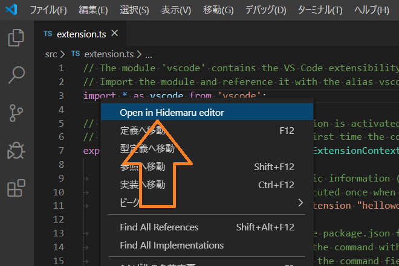
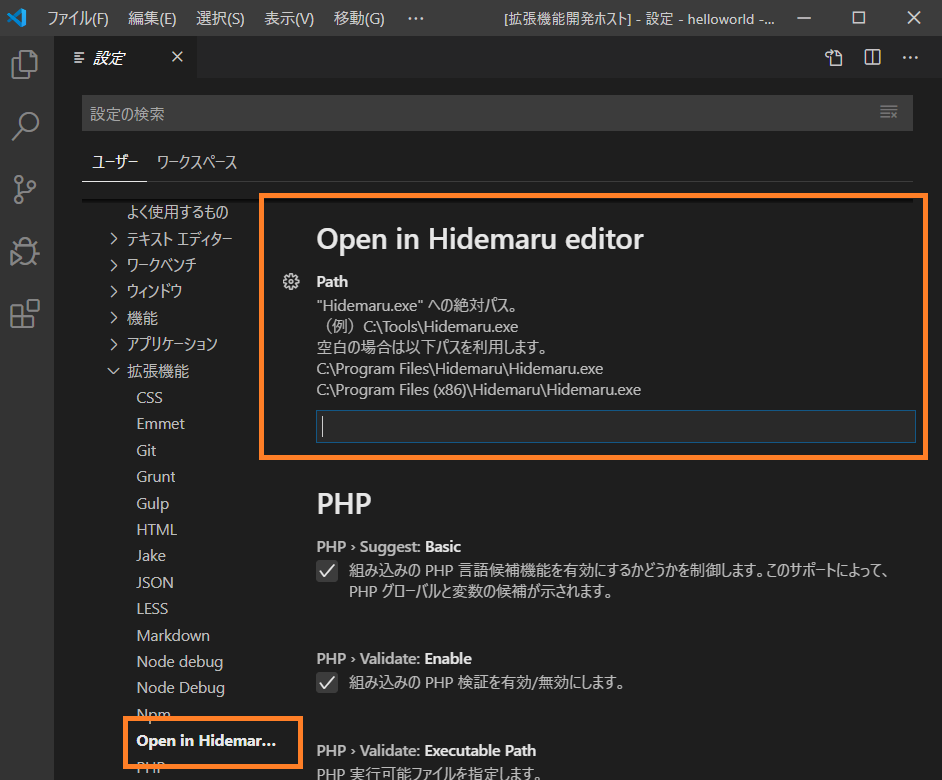

# Open in Hidemaru Editor

# Description

A Visual Studio Code extension that adds a right-click context menu command. Allows you to open the file in [Hidemaru editor](https://hide.maruo.co.jp/index.html).

# Images

## Explorer

## Tab

## Editor

## Setting

# Prerequisite

In order to use this extension, you must have Visual Studio Code, as well as [Hidemaru editor](https://hide.maruo.co.jp/index.html) installed.

# Settings

The extension will automatically find Hidemaru.exe when it's located at in the default install directory. If it's installed in a custom location, you can easily change it in the settings dialog.

# Contact

- <https://ohtorii.hatenadiary.jp>
- <https://twitter.com/ohtorii>
- <https://github.com/ohtorii/OpeninHidemaruEditor>

# Donate

If you like it, I'd be happy if you donated the game from Steam.

- https://store.steampowered.com/wishlist/id/ohtorii

It will encourage development😊
